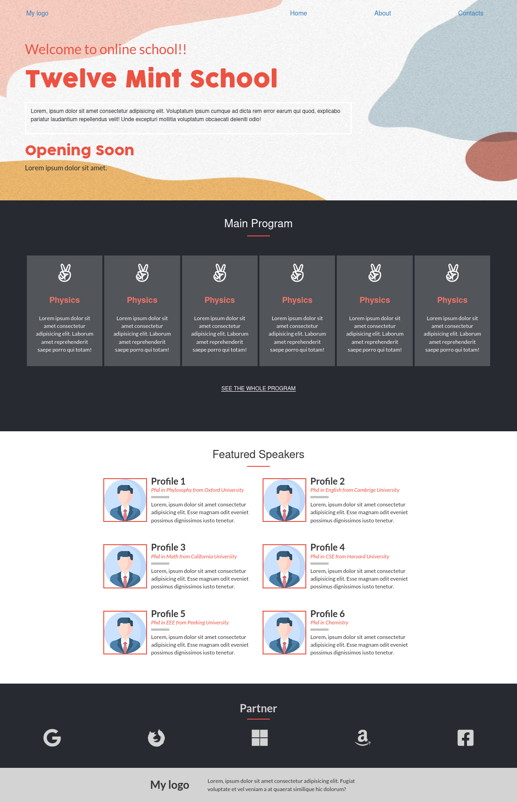
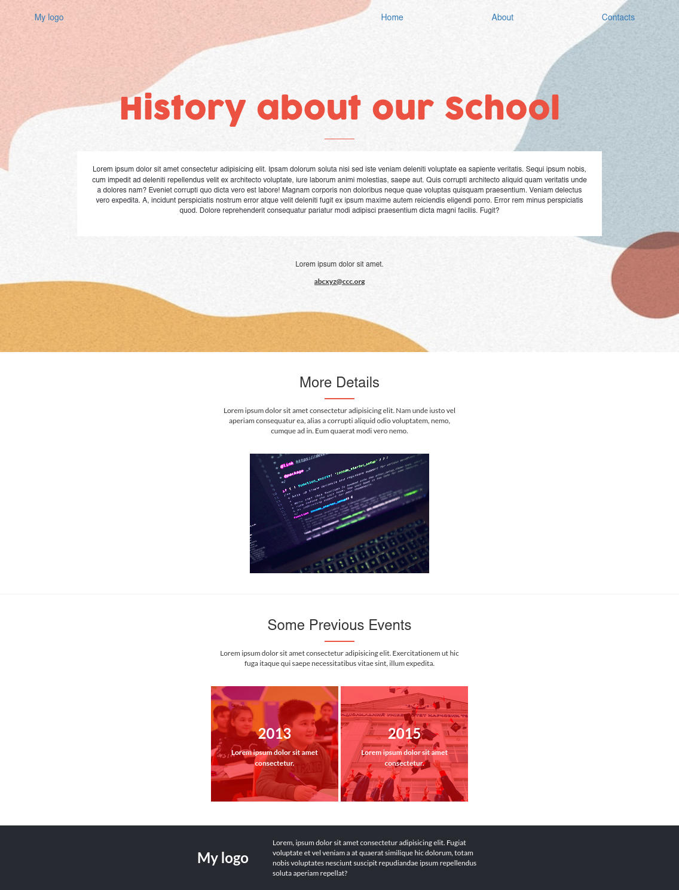
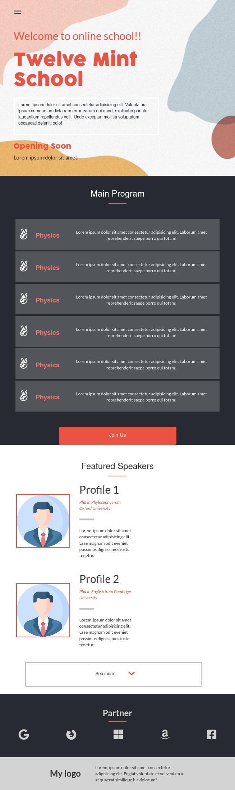
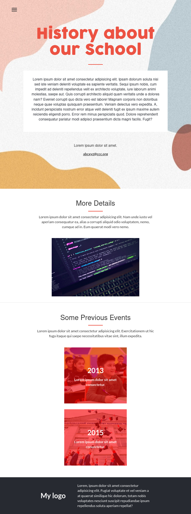
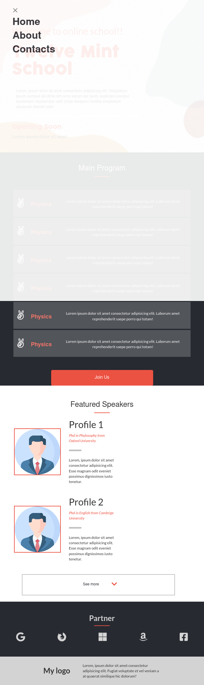

# Developers Portfolio of Tufahel Ahmed

This is the first capstone project of Tufahel Ahmed in Microverse. Tufahel Ahmed is coding scince 2017. He has coding experience on C,C++,Java,HTML,CSS,REACT and a little bit NodeJs. He has developed some websites for personal experience and use.

# Live Page Link

[Live link](https://tufahel.github.io/first-capstone-microverse/)

# Getting Started
To get a local copy up and running follow these simple example steps.

- Download this git repo.
- Extract this git copy.
- Open index.html file with google chrome.

# Pic
- Desktop Version

- First page
- 

- Second page
- 

- Mobile Version

- First page
- 

- Second page
- 

- Mobile Menu
- 

## Built With

- HTML/CSS
- Bootstrap
- Javascript DOM

## Authors

👤 Author1

- GitHub: [@Tufahel](https://github.com/Tufahel)
- LinkedIn: [Tufahel Ahmed](https://bd.linkedin.com/in/tufahel-ahmed-972884203)

## Acknowledgments

- Thanks to [CindyShin](https://www.behance.net/adagio07), I have followed his content: [BehanceTemplate](https://www.behance.net/gallery/29845175/CC-Global-Summit-2015) 